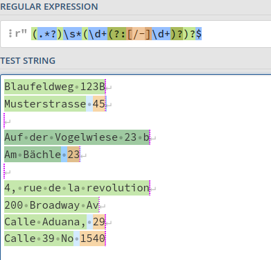

# FRIDAY_code_challenge
Code challenge for FRIDAY enterprise

# Modus operandi

1. Read statement

2. Free thinking: 
    - First challenge looks easy, thinking about split() / strip(). 
    - Second challenge also easy, read until a numeric is found.
    - Third challenge looks like it needs another field such as postal code or an IA app to identify the country so as to know how to split streets or maybe an IA that learns how to split streets. 
    - Do I need a country, street and number database to cover all cases? 

3. Looks like regex is needed for the second challenge, did not think about german dictionary, is not going to be easy.
    - [Nice link!](https://regex101.com/r/fi5Ca2/1)
    -  [Nice link 2!](https://stackoverflow.com/questions/55774903/regular-expression-to-split-a-street-address-that-may-have-optional-numbers-with)
    
    - Need to try to understand how does regex exactly works and adapt to my needs.

# Faced problems
## Multiple SSH keys on same machine
1. To clone and interact with another github account, just create a new ssh-key:

```
ssh-keygen -t rsa
```

2. Save it on **/home/jon/.ssh/** with a different name if one already exists.
 
```
 ssh-add ~/.ssh/<new_private_key_file>  
 ```

3. Copy public key and paste on Github>Settings>SSH and GPG keys

4. Add configuration on **/home/jon/.ssh/config**
```
  Host <alias_name>
    Hostname github.com
    User git
    IdentityFile ~/.ssh/<new_private_key_file> 
    IdentitiesOnly yes
 ```
 5. Finally clone repository with 
  ```
 git clone <alias_name>:<github_name>/<proyect_name>.git
 ```

## REGEX
 - **([a-zA-Z \u0080-\uFFFF]*)\d*.*'**


1st Capturing Group ([a-zA-Z \u0080-\uFFFF]*)

Match a single character present in the list below [a-zA-Z \u0080-\uFFFF]

- **'*'** matches the previous token between zero and unlimited times, as many times as possible, giving back as needed (greedy)

- **a-z** matches a single character in the range between a (index 97) and z (index 122) (case sensitive)

- **A-Z** matches a single character in the range between A (index 65) and Z (index 90) (case sensitive)
  matches the character   with index 3210 (2016 or 408) literally (case sensitive)

- **\u0080-\uFFFF** matches a single character in the range between € (index 128) and ￿ (index 65535) (case sensitive)

- **\d** matches a digit (equivalent to [0-9])

- **'*'** matches the previous token between zero and unlimited times, as many times as possible, giving back as needed (greedy)

- . matches any character (except for line terminators)
- **'*'** matches the previous token between zero and unlimited times, as many times as possible, giving back as needed (greedy)

- ' matches the character ' with index 3910 (2716 or 478) literally (case sensitive)

**Global pattern flags** 

- **g modifier**: global. All matches (don't return after first match)

- **m modifier**: multi line. Causes ^ and $ to match the begin/end of each line (not only begin/end of string)